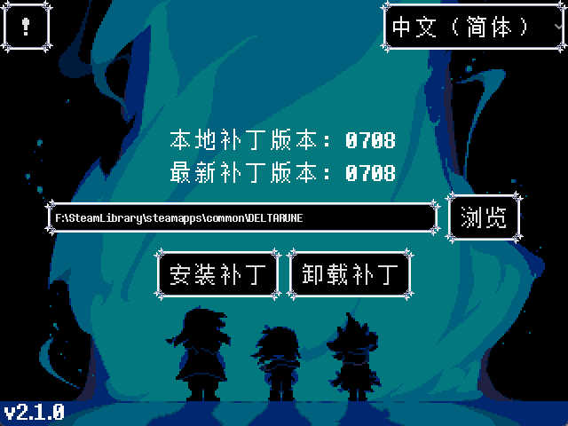

# DELTARUNE 汉化安装器

**下载安装器：[GitHub Release](https://github.com/gm3dr/DeltaruneChinesePatcher/releases/latest)**

在线下载并一键安装 [DELTARUNE 汉化补丁](https://github.com/gm3dr/DeltaruneChinese/releases)

> [!NOTE]
> 补丁安装方法见 **[此处](https://github.com/gm3dr/DeltaruneChinese/blob/main/README.md#%E8%A1%A5%E4%B8%81%E5%AE%89%E8%A3%85%E6%96%B9%E6%B3%95)**
> 如果无法正常使用安装器安装补丁<br>
> 可以通过手动方法来进行安装<br>
> 手动安装方式见 **[此处](https://github.com/gm3dr/DeltaruneChinese/blob/main/README.md#%E6%89%8B%E5%8A%A8%E5%AE%89%E8%A3%85)**

## 截图



## 开发工具

- [Godot Engine](https://godotengine.org) *(修改只需要使用 4.4.1 Stable Mono，文件中的 4.4.2-rc 是用于压缩文件大小的自定义导出模板)*
```
Windows 自定义导出模板构建脚本
scons platform=windows arch=x86_64 target=template_release module_mono_enabled=yes production=yes d3d12=yes angle_libs=${{ env.ANGLE_LIB_PATH }} debug_symbols=no optimize=size disable_3d=yes lto=full module_text_server_adv_enabled=no module_text_server_fb_enabled=yes
${{ env.GODOT_EDITOR_PATH }} --headless --generate-mono-glue modules/mono/glue
python "./modules/mono/build_scripts/build_assemblies.py" --godot-output-dir=./bin  --push-nupkgs-local ${{ env.LOCAL_NUGET_PATH }}
Linux 编辑器与自定义导出模板构建脚本
scons platform=linuxbsd arch=x86_64 target=editor module_mono_enabled=yes production=yes debug_symbols=no optimize=size lto=full module_text_server_adv_enabled=no module_text_server_fb_enabled=yes
scons platform=linuxbsd arch=x86_64 target=template_release module_mono_enabled=yes production=yes debug_symbols=no optimize=size disable_3d=yes lto=full module_text_server_adv_enabled=no module_text_server_fb_enabled=yes
${{ env.GODOT_EDITOR_PATH }} --headless --generate-mono-glue modules/mono/glue
python "./modules/mono/build_scripts/build_assemblies.py" --godot-output-dir=./bin --push-nupkgs-local ${{ env.LOCAL_NUGET_PATH }}
```
- [.NET 8 SDK](https://dotnet.microsoft.com)
- [Gameloop.Vdf](https://www.nuget.org/packages/Gameloop.Vdf)
- [rcedit](https://github.com/electron/rcedit) *(非必须, 用于 Windows 平台导出时修改 exe 资源)*
- [UPX](https://github.com/upx/upx/releases) *(非必须, 用于压缩可执行文件大小)*

## 路线图

 - [x] \[v1.1.0\] 补丁安装失败错误信息
 - [x] \[v1.1.0\] Linux 平台支持
 - [x] \[v1.1.0\] 安装失败时恢复备份
 - [x] \[v2.0.0\] 设计界面外观
 - [x] \[v2.0.0\] 在线获取并一键下载最新汉化补丁
 - [x] \[v2.0.0\] 检测目录下Readme并弹出窗口
 - [x] \[v2.1.0\] 调用本地安装的 XDelta3 与 7-Zip
 - [x] \[v2.1.0\] Linux 与 macOS 自动`chmod +x`外部程序
 - [x] \[v2.1.0\] 删除汉化补丁 (将被覆盖的内容存储到Backup目录用于还原)
 - [ ] \[v2.1.2\] 默认 DELTARUNE 路径
 - [ ] \[v2.1.2\] 从默认 Steam 路径读取 libraryfolders.vdf 来获取 DR 安装路径
 - [ ] \[v2.1.2\] Windows 从注册表获取 Steam 路径后读取 libraryfolders.vdf 来获取 DR 安装路径
 - [ ] \[v2.1.2\] 安装后显示安装用时
 - [ ] macOS 平台支持

## 借物


<table>
	<tr>
		<th>资源</th>
		<th>提供者</th>
	</tr>
	<tr>
		<td>DELTARUNE 资源</td>
		<td rowspan="2">Toby Fox</td>
	</tr>
	<tr>
		<td>Determination Sans</td>
	</tr>
    <tr>
        <td>Godot Engine</td>
        <td>Juan Linietsky, Ariel Manzur 与贡献者们</td>
    </tr>
    <tr>
        <td>.NET 8</td>
        <td rowspan="2">Microsoft 与贡献者们</td>
    </tr>
    <tr>
        <td>Visual Studio Code</td>
    </tr>
    </tr>
        <td>7-Zip</td>
        <td>Igor Pavlov</td>
    </tr>
    </tr>
        <td>XDelta</td>
        <td>Joshua MacDonald</td>
    </tr>
    </tr>
        <td>UPX</td>
        <td>Markus & Laszlo & John</td>
    </tr>
    </tr>
        <td>rcedit</td>
        <td>electron 开源贡献者</td>
    </tr>
    </tr>
        <td>Gameloop.Vdf</td>
        <td>Shravan Rajinikanth</td>
    </tr>
    </tr>
        <td>SimSunBDF</td>
        <td>北京中易中标电子信息技术有限公司</td>
    </tr>
    </tr>
        <td>应用图标</td>
        <td>WhatDamon</td>
    </tr>
</table>

 ## 开源协议

MIT License